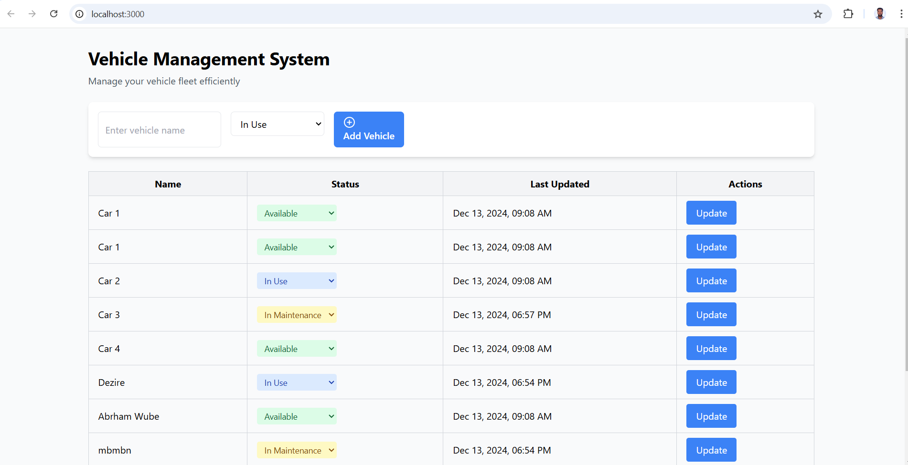
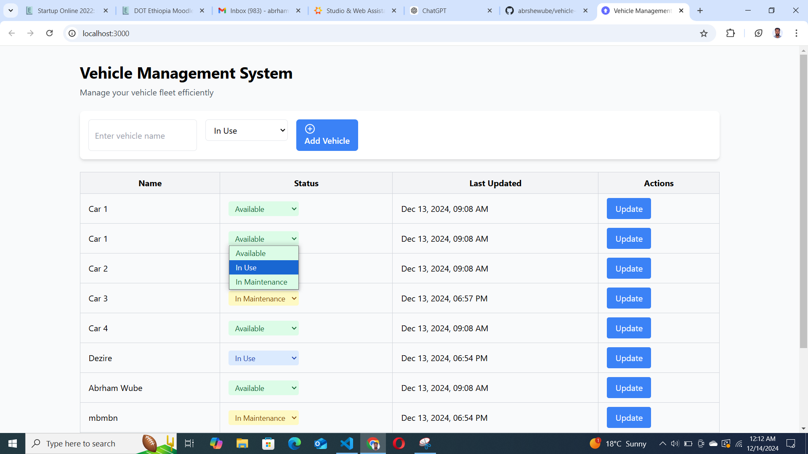

# Vehicle Management System

A simple Vehicle Management System built using the MERN stack (MongoDB, Express.js, React, Node.js).

---

## Features
- Manage vehicle details efficiently.
- Frontend: React for dynamic and responsive user interface.
- Backend: Node.js and Express.js for server-side functionality.
- Database: MongoDB for data storage.

---

## Prerequisites
Before you begin, ensure you have the following installed on your machine:

1. **Node.js** (latest LTS version recommended)
2. **MongoDB** (running locally )

---

## Installation and Setup

### 1. Clone the Repository
```bash
git clone https://github.com/abrshewube/vehicle-managmnet-task
cd vehicle-managmnet-task
```

### 2. Frontend Setup
Navigate to the frontend directory and set up the React application:
```bash
cd frontend
npm install
npm run dev
```
This will start the frontend server. Open your browser and navigate to the URL displayed in the terminal (usually `http://localhost:3000`).

### 3. Backend Setup
Navigate to the backend directory and set up the Node.js server:
```bash
cd backend
npm install
```
Ensure that MongoDB is running locally or is accessible via your specified URI. Then start the backend server:
```bash
npm start
```
The backend server will run on `http://localhost:5000`.

---

## Project Structure
```
├── frontend          # React-based frontend
├── backend           # Node.js backend with Express.js
└── README.md         # Project documentation
```

---

## Screenshots
Below are screenshots demonstrating the system in action:

1. **Image 1:**
   

2. **Image2:**
   


---

## Important Notes
- Ensure that MongoDB is running before starting the backend server.
- The frontend and backend servers should run simultaneously for the application to function correctly.

---

## Troubleshooting
If you encounter any issues:
1. Verify that Node.js and MongoDB are installed and running.
2. Check that all dependencies are installed by running `npm install` in both `frontend` and `backend` directories.
3. Ensure no other application is using ports `3000` (frontend) or `5000` (backend).

---
